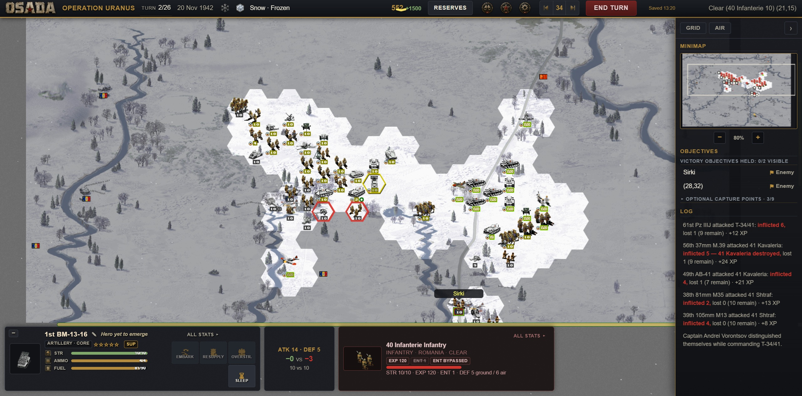
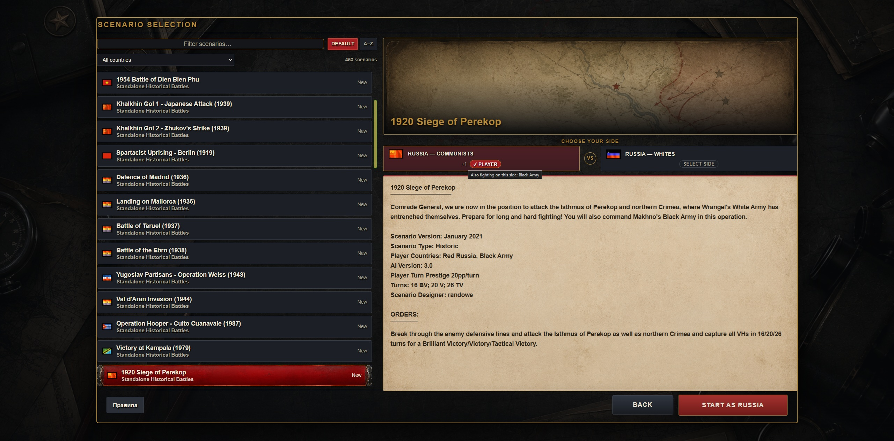
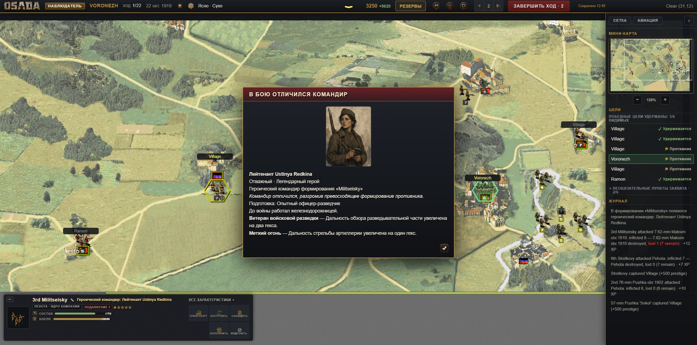
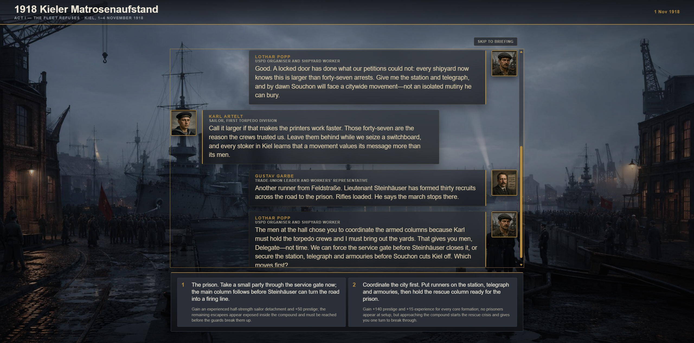
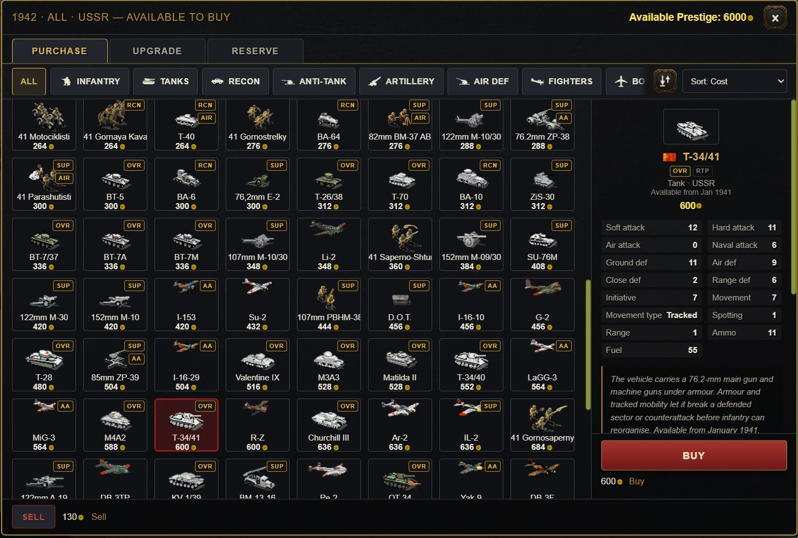

# OSADA

**A turn-based historical strategy game in your browser. Build an army, lead it through campaigns, and watch its commanders become heroes.**

## [Play OSADA →](http://135.106.183.92/)

No installation needed. The tutorial is available inside the game.



*Operation Uranus — coordinate your forces across a frozen battlefield, manage supplies, and capture objectives before time runs out.*

OSADA carries the hex-based strategy of Panzer General 2 into a browser game with persistent formations, evolving commanders, story-driven decisions, and configurable rules. It began as a Kotlin/JS port of Open Panzer / Panzer Marshal and includes campaigns and scenarios adapted from Open General.

## What you can play

- **Historical campaigns and standalone battles.** Fight across different eras and theatres, with a particular focus on Soviet, Republican, partisan, and revolutionary campaigns.
- **An army that grows with you.** Carry core formations from battle to battle, preserve their experience, replace losses, and upgrade their equipment as a campaign progresses.
- **Procedurally generated heroes.** Commanders emerge through combat with their own identities and biographies. Develop them through a broad range of abilities, follow their service histories, and have a chance to acquire rare legendary heroes.
- **Story choices with consequences.** In supported campaigns, pre-battle conversations offer decisions that affect resources, forces, and events on the battlefield.
- **Rulesets you can make your own.** Select and edit rule profiles to change individual mechanics, including how anti-aircraft defence works. Tailor a campaign or scenario to the style of play you prefer.
- **Combined-arms tactics.** Bring together infantry, armour, artillery, aircraft, and naval forces while accounting for terrain, weather, visibility, ammunition, and fuel.
- **Solo and multiplayer play.** Play against the AI or face another player in online scenario battles. Multiplayer uses a room server with the host's browser resolving the game rules.
- **Desktop and touch controls.** Play with a mouse or use the adaptive touch interface. English and Russian UI translations are available; authored campaign and scenario text varies by content.

## A closer look

### Choose your battlefield

Browse scenarios, read the briefing, choose a side, and adjust the rules before taking command.



### Meet your commanders

A distinguished formation can gain a hero. Portraits, biographies, abilities, and service records give your army a history that lasts beyond a single battle.



### Make decisions before the first shot

Story campaigns connect conversations to the battle ahead. A decision can change the troops at your disposal, the resources you receive, or the situation you must resolve on the map.



### Build your force

Spend prestige on new units, upgrade existing formations, and manage reserves. Available equipment depends on the date, nation, and scenario's purchase rules.



## Getting started

Open [the game](http://135.106.183.92/) and begin with the tutorial, choose a campaign, or jump into a standalone scenario. The tutorial introduces the battlefield controls and the basic flow of a turn.

Progress can be saved in your browser and exported to a file. Keep exported saves if you want to move between browsers or devices.

## Running from source

The game client is written in **Kotlin/JS**, with HTML, CSS, and game assets served as static resources. The multiplayer room server is a separate **Kotlin/JVM application using Ktor**.

Use **JDK 25** with `JAVA_HOME` configured. The repository includes the Gradle wrapper; Gradle manages the Kotlin/JS toolchain and its Node.js dependencies. The first build needs an internet connection to download dependencies.

```sh
git clone https://github.com/Yefimov/osada.git
cd osada
./gradlew jsBrowserDevelopmentRun
```

On Windows PowerShell, use `./gradlew.bat jsBrowserDevelopmentRun`. Open the local address printed by the development server.

To produce a static browser build:

```sh
./gradlew jsBrowserDistribution
```

The output is written to `build/dist/js/productionExecutable/`. Serve that directory over HTTP. Online rooms also require the multiplayer server; the static build alone runs the game client.

The main source directories are:

| Directory | Contents |
| --- | --- |
| `src/jsMain/kotlin/org/osada/` | Game rules, AI, campaigns, heroes, saves, and UI |
| `src/jsMain/resources/` | Browser entry point, styles, translations, and game assets |
| `src/jsTest/kotlin/org/osada/` | Client tests |
| `multiplayer-server/` | Multiplayer room server and its tests |

Python 3 is needed for the static checks, and browser smoke tests additionally use Node.js/npm and Chrome.

The checked-in `gradle.properties` contains a Windows-specific encoding setting. On Linux or macOS, remove that setting or override it with `-Dorg.gradle.jvmargs=-Dfile.encoding=UTF-8` when invoking Gradle.

## Credits and origins

OSADA builds on the work of the Panzer General community:

- **Panzer General 2**, by Strategic Simulations, Inc. (SSI), established the original game design and heritage.
- **[Open Panzer / Panzer Marshal](https://github.com/nicupavel/openpanzer)**, by Nicu Pavel and contributors, provided the browser engine that OSADA ported to Kotlin/JS, as well as inspiration for its continued development.
- **[Open General](https://www.open-general.com/)**, by Luis Guzman and its community, carries that tradition forward. OSADA adapts campaigns, scenarios, and equipment data from its ecosystem.
- **The Open General Icons project and community artists** created unit graphics used by these games. Scenario designers, campaign authors, map makers, and equipment authors made the breadth of historical content possible.

### Graphical assets and other resources

OSADA includes inherited and adapted graphical assets and other resources from the Open Panzer / Panzer Marshal and Open General ecosystems, alongside OSADA-specific additions. Original campaigns, scenarios, maps, and unit artwork are credited to their respective creators; they are not presented as original OSADA work.

The upstream Open Panzer project identifies its code as GPL version 2 or later. See its [README](https://github.com/nicupavel/openpanzer#readme) for the upstream notice and resource acknowledgements. Third-party artwork and content retain their respective authorship and applicable terms.
